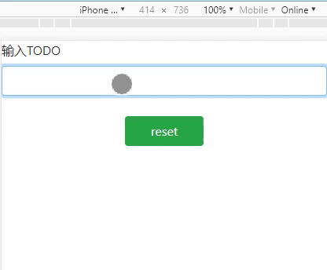

## react-hooks-demo

## 预览图

## React hooks
> 你还在为该使用无状态组件（Function）还是有状态组件（Class）而烦恼吗？

——拥有了hooks，你再也不需要写Class了，你的所有组件都将是Function。
你还在为搞不清使用哪个生命周期钩子函数而日夜难眠吗？
——拥有了Hooks，生命周期钩子函数可以先丢一边了。
你在还在为组件中的this指向而晕头转向吗？
——既然Class都丢掉了，哪里还有this？你的人生第一次不再需要面对this。
这样看来，说React Hooks是今年最劲爆的新特性真的毫不夸张。如果你也对react感兴趣，或者正在使用react进行项目开发，答应我，请一定抽出至少30分钟的时间来阅读本文好吗？

## 相关文章教程

- https://juejin.im/post/5be3ea136fb9a049f9121014
